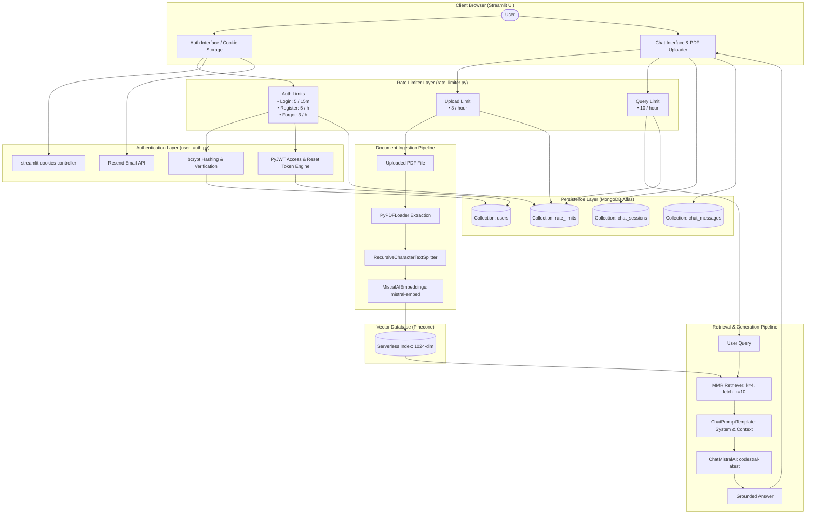
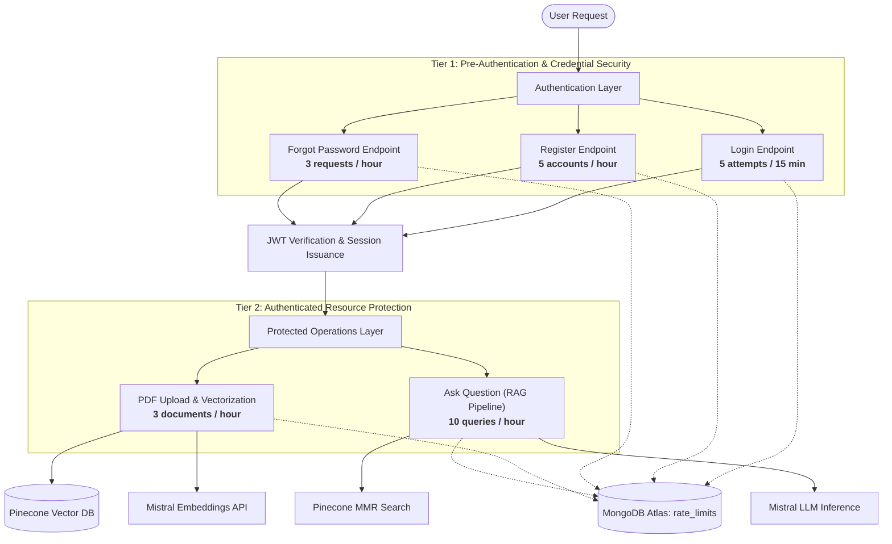

# RAG Book Assistant

A cloud-native Retrieval-Augmented Generation (RAG) web application that enables users to upload PDF books, index them into vector storage, and query them with grounded, context-aware responses powered by Mistral AI, Pinecone, MongoDB Atlas, and Streamlit.

---

## 2. Overview

### Problem Statement
Standard Large Language Models (LLMs) suffer from hallucinations and lack knowledge of private, custom, or newly published texts. Uploading full books or documents directly into a raw LLM prompt window causes context window overflow, high token consumption, and degraded response precision.

### Solution
**RAG Book Assistant** implements a Retrieval-Augmented Generation (RAG) pipeline. Rather than feeding an entire book to an LLM, the application extracts and partitions the document into semantic chunks, generates high-dimensional embeddings, and indexes them in a serverless vector database (Pinecone). 

When a user asks a question:
1. Only the most semantically relevant text passages are retrieved using Maximal Marginal Relevance (MMR) search.
2. The retrieved passages are provided as strict boundary context to Mistral AI (`codestral-latest`).
3. The model answers exclusively from the retrieved context, eliminating hallucinated claims.
4. User accounts, chat sessions, and message exchanges are persistently tracked in MongoDB Atlas.

---

## 3. Key Features

- **PDF Upload and Processing**: Upload PDF documents directly through the Streamlit interface with automated file writing to temporary storage.
- **Text Extraction and Chunking**: Extracted using LangChain's `PyPDFLoader` and partitioned into overlapping segments (chunk size: 1000 characters, overlap: 200 characters) via `RecursiveCharacterTextSplitter`.
- **Vector Embeddings**: Generates 1024-dimensional dense vector embeddings using Mistral AI (`mistral-embed`).
- **Serverless Vector Database**: Automatically provisions and manages a cosine-metric serverless index in Pinecone (`aws/us-east-1`).
- **MMR Context Retrieval**: Implements Maximal Marginal Relevance (MMR) retrieval (`k=4`, `fetch_k=10`, `lambda_mult=0.5`) to maximize context relevance while reducing redundant information.
- **Strictly Grounded Question-Answering**: Configured with a system prompt that mandates answering strictly from the context, defaulting to *"I could not find the answer in the document."* if the query cannot be satisfied.
- **User Authentication**: User registration and login protected with salted `bcrypt` password hashing.
- **JWT Token Management**: Stateless access tokens (signed using `HS256`, 24-hour expiration) and password reset tokens (15-minute expiration) generated and verified with `PyJWT`.
- **Browser Cookie Persistence**: Stores the authenticated JWT in a browser cookie via `streamlit-cookies-controller` (7-day max-age, `SameSite=Lax`), preventing unexpected session loss during browser reloads.
- **Email-Based Password Reset**: Dispatches HTML password reset emails containing signed JWT reset tokens using the Resend API, with an automatic in-app console fallback for local development environments lacking API credentials.
- **Multi-Tier Sliding-Window Rate Limiting**: Protects authentication and application routes against abuse, with live quota tracking and cooldown alerts:
  - **Login**: 5 attempts per 15 minutes
  - **Register**: 5 accounts per hour
  - **Forgot Password**: 3 reset requests per hour
  - **PDF Upload**: 3 document vectorizations per hour
  - **Ask Question**: 10 LLM queries per hour
- **Full Chat Session Management**: ChatGPT-style sidebar managing multi-session chat histories, session auto-titling based on the first prompt, conversation switching, and single-click chat deletion (`🗑️`) that cleans up both sessions and message history in MongoDB Atlas.

---

## 4. System Architecture

### Data and Query Flow




### MongoDB Data Flow
- **Users**: Credential creation, lookup, and password updates are transacted against the `users` collection. Unique indexes enforce distinct usernames and emails.
- **Sessions**: The active session ID is assigned on the first query. Titles are auto-derived from the user's initial question (`title[:60]`) and stored with a timestamp index.
- **Messages**: User queries and assistant responses are appended chronologically to the `chat_messages` collection, bound to the parent `session_id`.

---

## 5. Tech Stack

| Component | Technology | Description |
|---|---|---|
| **Language** | Python 3.11+ | Core runtime environment |
| **Package Manager** | uv | High-performance Python package and environment manager |
| **Web Framework** | Streamlit | Interactive web UI, reactive rerun state, and component rendering |
| **AI Orchestration** | LangChain | Pipeline abstraction for loaders, splitters, embeddings, and chat models |
| **LLM Provider** | Mistral AI | `codestral-latest` (generation) and `mistral-embed` (1024-dim embeddings) |
| **Vector Database** | Pinecone | Serverless cloud vector index with cosine similarity search |
| **Database** | MongoDB Atlas | Cloud-hosted document database for users, sessions, and chat history |
| **Database Driver** | PyMongo | Native MongoDB driver for index creation and atomic CRUD operations |
| **Authentication** | PyJWT | JSON Web Token encoding, decoding, expiration, and cryptographic verification |
| **Password Hashing** | bcrypt | Salted password hashing and constant-time hash verification |
| **Email Service** | Resend | Transactional email dispatch for password recovery workflows |
| **Client Storage** | streamlit-cookies-controller | Bridge between Streamlit sessions and browser-level client cookies |

---

## 6. Project Structure

```
osd_rag/
├── .streamlit/
│   └── config.toml           # Streamlit server and security configuration
├── .env.example              # Template of required environment variables
├── .gitignore                # Git ignore configuration
├── .python-version           # Target Python version pin (3.11)
├── main.py                   # Default application entrypoint stub
├── osd_rag.py                # Main Streamlit application, RAG pipeline, and chat UI
├── pyproject.toml            # Project metadata and locked dependencies
├── rate_limiter.py           # Sliding-window rate limiter with MongoDB Atlas TTL indexing
├── README.md                 # Complete system documentation
├── requirements.txt          # Exported pip-compatible dependency manifest
├── test_mistral.py           # Integration validation script for Mistral AI connectivity
└── user_auth.py              # Cryptography, JWT engine, user operations, and auth UI

```

---

## 7. How RAG Works

The Retrieval-Augmented Generation process in this repository executes in eight discrete steps:

1. **PDF Upload**: The user uploads a `.pdf` file via `st.file_uploader`. The file stream is written to a temporary disk location via `tempfile.NamedTemporaryFile`.
2. **PDF Parsing**: LangChain's `PyPDFLoader` reads the file on disk and converts each page into an individual Document object containing page text and page metadata.
3. **Text Chunking**: `RecursiveCharacterTextSplitter` recursively inspects paragraphs, newlines, and spaces to break documents into uniform chunks of 1000 characters with a 200-character overlap, maintaining semantic continuity across boundaries.
4. **Embedding Generation**: Chunks are forwarded to Mistral AI's embedding endpoint (`mistral-embed`), generating 1024-dimensional floating-point vector representations.
5. **Vector Storage**: Vectors, accompanied by original text contents as metadata, are upserted into the specified Pinecone Serverless index (`rag-book-assistant`) using cosine metric distance.
6. **Similarity/MMR Retrieval**: When the user enters a prompt, the query is converted into a vector embedding. Pinecone performs a **Maximal Marginal Relevance (MMR)** search:
   - Fetches an initial candidate pool of 10 matches (`fetch_k=10`).
   - Selects the top 4 matches (`k=4`) with a diversity penalty factor (`lambda_mult=0.5`) to prevent duplicate context.
7. **Context Construction**: The retrieved document chunks are concatenated with double newline delimiters into a single `{context}` string block.
8. **LLM Response Generation**: The constructed context and query are inserted into `ChatPromptTemplate` and passed to `ChatMistralAI` (`codestral-latest`, `temperature=0`). The LLM evaluates the bounded context and outputs the final response.

---

## 8. Authentication

The authentication system is implemented in `user_auth.py` and enforces access before exposing the RAG interface:

- **Registration**: Users submit a username, email, and password. Usernames are sanitized to permit alphanumeric characters, spaces, dots, hyphens, and underscores. If omitted, the username defaults to the email prefix. Passwords require a minimum length of 6 characters.
- **Password Hashing**: Passwords are hashed using `bcrypt.hashpw` with unique random salts. Plaintext passwords are never persisted.
- **Login**: Users authenticate by supplying either their username or email address alongside their password. Passwords are verified via `bcrypt.checkpw`.
- **JWT Creation & Validation**:
  - **Access Token**: Signed using HMAC-SHA256 (`HS256`) with claims `sub` (user UUID), `username`, `email`, `iat`, `exp` (1440 minutes / 24 hours), and `token_type="access"`.
  - **Reset Token**: Signed using `HS256` with claims `sub` (email), `email`, `token_type="password_reset"`, `jti` (hex nonce), `iat`, and `exp` (15 minutes).
- **Session & Cookie Handling**: 
  - On successful login, the JWT access token is assigned to `st.session_state.jwt_token` and written to a client-side browser cookie named `rag_auth_jwt` via `streamlit-cookies-controller`.
  - *Note on Cookie Security*: Cookies are managed on the client side via the browser's document cookie storage (`SameSite=Lax`, 7-day duration) to survive Streamlit page refreshes (`F5`). They are not server-issued `HttpOnly` cookies.
- **Forgot Password**: Submitting a registered email address triggers `request_password_reset`, generating a 15-minute JWT reset token.
- **Email Reset Link**: The reset token and a direct action URL (`?reset_token=<token>`) are formatted into an HTML template and dispatched via the Resend API. If `RESEND_API_KEY` is not provided, the token is surfaced directly in the UI for local development convenience.
- **Password Reset**: The reset form verifies the JWT signature and `token_type="password_reset"`. Upon successful validation, the new password is hashed with bcrypt and updated in the user's MongoDB document. Existing authentication cookies are wiped to enforce re-login.

---

## 9. Rate Limiter Implementation

To prevent denial-of-service vectors, credential stuffing, brute-force dictionary attacks, and unauthorized depletion of third-party API quotas (Mistral AI embeddings, LLM inference, and Pinecone serverless vector writes), the application incorporates a multi-tier sliding-window rate limiting engine implemented in `rate_limiter.py`.

### Architecture & Operational Tiers

Rate limiting operates across two distinct operational boundaries:



1. **Tier 1: Pre-Authentication Protection (Security & Anti-Abuse)**
   - **Login**: Throttles invalid authentication attempts to mitigate brute-force password guessing and dictionary attacks.
   - **Registration**: Caps account creation velocity to prevent automated bot account spam.
   - **Forgot Password**: Restricts password reset requests to safeguard transactional email quotas (Resend API) and prevent inbox harassment.

2. **Tier 2: Authenticated Protected Routes (Resource & Cost Control)**
   - **PDF Upload & Ingestion**: Restricts document vectorization to prevent pipeline saturation, large disk storage consumption, and high Mistral embedding token costs.
   - **Question Answering**: Enforces a per-user query budget to balance Mistral AI `codestral-latest` generation quotas and Pinecone query consumption across users.

---

### Quota and Window Configuration

| Route / Action | Identifier / Key Scope | Quota Limit | Window Duration | Window (Sec) | Protected Resource | Reset / Clearance Policy |
|---|---|---|---|---|---|---|
| **Login** | `login:<username_or_email>` | 5 attempts | 15 minutes | 900s | bcrypt CPU, MongoDB auth | Cleared immediately on successful login |
| **Register** | `register:<email>` | 5 accounts | 1 hour | 3600s | MongoDB `users` collection | Sliding-window log expiration |
| **Forgot Password** | `forgot_password:<email>` | 3 requests | 1 hour | 3600s | Resend Email API quota | Sliding-window log expiration |
| **PDF Upload** | `pdf_upload:<user_id>` | 3 vectorizations | 1 hour | 3600s | Mistral Embeddings, Pinecone upserts | Sliding-window log expiration |
| **Ask Question** | `ask_question:<user_id>` | 10 queries | 1 hour | 3600s | Mistral LLM, Pinecone MMR retrieval | Sliding-window log expiration |

---

### Sliding-Window Log Algorithm Mechanics

Unlike simple fixed-window counters—which suffer from boundary bursting where a user can consume 2× their quota across the boundary minute—this system implements a true **Sliding-Window Log** algorithm:

1. **Window Boundary Calculation**:
   Given the current UTC timestamp $T_{\text{now}}$ and window duration $W$ (seconds), the boundary cutoff is calculated as:
   $$T_{\text{cutoff}} = T_{\text{now}} - W$$

2. **Log Fetching & Counting**:
   The engine queries the `rate_limits` collection in MongoDB for all documents matching the compound key `action:identifier` with `timestamp >= cutoff`:
   ```python
   records = list(
       db["rate_limits"]
       .find({"key": key, "timestamp": {"$gte": cutoff}})
       .sort("timestamp", 1)
   )
   ```

3. **Quota Evaluation**:
   - If `len(records) < max_requests`:
     - Access is granted (`is_allowed = True`).
     - Remaining quota is returned: `remaining = max_requests - len(records)`.
   - If `len(records) >= max_requests`:
     - Access is rejected (`is_allowed = False`).
     - Remaining quota is `0`.
     - The exact wait time until the earliest event expires out of the rolling window is computed:
       $$\Delta_{\text{retry}} = \max\left(1, \operatorname{int}\left(T_{\text{oldest}} + W - T_{\text{now}}\right)\right)$$
     - The cooldown duration is formatted into human-readable text via `format_time_remaining()` (e.g., `"14m 32s"` or `"45s"`).

4. **Event Recording**:
   When an action occurs (or a failed login attempt happens), `record_rate_limit_event(db, action, identifier)` inserts a record with a UTC timestamp.

5. **Failed Attempt Cleansing (Login)**:
   For authentication, failed attempts increment the rate limit log. Upon entering valid credentials, `clear_rate_limit(db, "login", identifier)` flushes recorded failures for that account, ensuring legitimate users are not penalized on subsequent logins.

---

### MongoDB Persistence & Automated 24h TTL Eviction

Event records are persisted to MongoDB Atlas in the `rate_limits` collection:

```javascript
{
  "_id": ObjectId("66eb25..."),
  "key": "ask_question:johndoe",
  "action": "ask_question",
  "identifier": "johndoe",
  "timestamp": ISODate("2026-09-19T01:30:00.000Z")
}
```

#### Indexing Strategy
- **Compound Lookup Index**: `[("key", 1), ("timestamp", -1)]`
  - Facilitates instant index scans for filtering events within the active window without scanning collection documents.
- **Automated TTL Index**: `{"timestamp": 1}` with `expireAfterSeconds = 86400` (24 hours)
  - MongoDB's background cleanup process automatically purges expired rate limit records once they exceed 24 hours. No cron jobs, scheduled tasks, or manual table maintenance are required.

#### Fault Tolerance & In-Memory Fallback
If MongoDB Atlas encounters temporary network partitioning or downtime, `rate_limiter.py` catches `PyMongoError` exceptions and gracefully degrades to an in-process Python memory store (`_memory_rate_limits`). This ensures the application continues operating securely without throwing unhandled exceptions to users.

---

### User Experience & Cooldown Feedback

The rate limiting engine is tightly integrated into the Streamlit interface to provide transparent feedback:

- **Live Usage Badges**:
  - The sidebar continuously reports current question quota usage: `📊 Questions: X/10 this hour` (powered by `get_rate_limit_status`).
  - The upload view displays document budget counters: `📊 Upload quota: X/3 remaining this hour`.
- **Informative Error Banners**:
  - When a rate limit is reached, descriptive alerts inform the user of the exact cooldown duration rather than generic errors:
    ```text
    ⚠️ Rate limit reached: Maximum 10 questions per hour. Please wait 14m 32s before asking another question.
    ```
    ```text
    ⚠️ Too many login attempts. Rate limit is 5 per 15 minutes. Please wait 12m 45s before trying again.
    ```

---

## 10. MongoDB Data Model

The application interfaces with a single MongoDB database named `rag_book_assistant` across four collections:

### 1. `users` Collection
Stores registered user credentials and account metadata.

```javascript
{
  "_id": "389a19b5-990f-4a13-956c-f5cadc2e884f",       // UUID string
  "username": "johndoe",                                 // Unique indexed string
  "email": "johndoe@example.com",                        // Unique indexed string (lowercase)
  "password_hash": "$2b$12$e8Y7zK...hashed_string",     // Salted bcrypt hash
  "created_at": ISODate("2026-09-19T00:00:00.000Z"),
  "updated_at": ISODate("2026-09-19T00:00:00.000Z")
}
```
*Indexes*:
- `{"username": 1}` (Unique)
- `{"email": 1}` (Unique)

### 2. `chat_sessions` Collection
Stores high-level metadata for individual conversation threads.

```javascript
{
  "_id": "67f1b2c4-88aa-41d3-92f0-109b3d0e5124",       // UUID string
  "user_id": "johndoe",                                  // Bound to username
  "title": "What are the core concepts of Chapter 1?",  // Truncated to 60 characters
  "created_at": ISODate("2026-09-19T00:05:00.000Z")
}
```
*Indexes*:
- `[("user_id", 1), ("created_at", -1)]`

### 3. `chat_messages` Collection
Stores individual turns (user inputs and assistant responses) belonging to a session.

```javascript
{
  "_id": ObjectId("66eb20..."),
  "session_id": "67f1b2c4-88aa-41d3-92f0-109b3d0e5124", // References chat_sessions._id
  "role": "user",                                        // "user" or "assistant"
  "content": "What are the core concepts of Chapter 1?",
  "created_at": ISODate("2026-09-19T00:05:01.000Z")
}
```
*Indexes*:
- `[("session_id", 1), ("created_at", 1)]`

### 4. `rate_limits` Collection
Stores sliding-window event timestamps for rate-limited operations with automated TTL expiration.

```javascript
{
  "_id": ObjectId("66eb25..."),
  "key": "ask_question:johndoe",                        // action:identifier
  "action": "ask_question",                              // Action name
  "identifier": "johndoe",                              // User or credential identifier
  "timestamp": ISODate("2026-09-19T01:30:00.000Z")       // UTC execution timestamp
}
```
*Indexes*:
- `[("key", 1), ("timestamp", -1)]`
- `{"timestamp": 1}` (`expireAfterSeconds=86400` — automated 24-hour TTL cleanup)

---


## 11. Environment Variables

Create a `.env` file in the root directory. Use `.env.example` as a template:

```env
# AI & Vector Database
MISTRAL_API_KEY=your_mistral_api_key_here
PINECONE_API_KEY=your_pinecone_api_key_here
PINECONE_INDEX=rag-book-assistant

# MongoDB Atlas
MONGODB_URI=mongodb+srv://<username>:<password>@<cluster>.mongodb.net/?retryWrites=true&w=majority
MONGODB_DB=rag_book_assistant

# Authentication (JWT)
JWT_SECRET=your_jwt_secret_key_change_in_production
JWT_ALGORITHM=HS256
JWT_ACCESS_EXPIRE_MINUTES=1440
JWT_RESET_EXPIRE_MINUTES=15

# Email Dispatch (Resend - Optional)
RESEND_API_KEY=your_resend_api_key_here
FROM_EMAIL=onboarding@resend.dev
APP_URL=http://localhost:8501
```

> **CRITICAL SECURITY NOTE**: Never commit `.env` to version control. The repository includes `.gitignore` configured to exclude `.env`. Exposing live API keys or database credentials compromises your cloud infrastructure.

---

## 12. Installation

The project uses [uv](https://github.com/astral-sh/uv) for fast, reproducible Python virtual environments.

### PowerShell Setup (Windows)

```powershell
# 1. Clone repository
git clone https://github.com/xoloAyush/Rag-Book-Assistant.git
cd Rag-Book-Assistant

# 2. Create and activate a virtual environment
uv venv
.\.venv\Scripts\Activate.ps1

# 3. Synchronize locked dependencies from pyproject.toml
uv sync
```

Alternatively, if installing via standard pip:
```powershell
pip install -r requirements.txt
```

---

## 13. Configuration

1. **MongoDB Atlas**:
   - Register at [mongodb.com/atlas](https://www.mongodb.com/atlas) and deploy a free-tier cluster.
   - Under Database Access, create a user with read/write permissions.
   - Under Network Access, whitelist your IP address (or `0.0.0.0/0` for development).
   - Copy the SRV URI into `MONGODB_URI`.
2. **Mistral AI**:
   - Create an account at [console.mistral.ai](https://console.mistral.ai) and generate an API key.
   - Paste the key into `MISTRAL_API_KEY`.
3. **Pinecone**:
   - Register at [pinecone.io](https://www.pinecone.io) and generate an API key.
   - Paste the key into `PINECONE_API_KEY`.
   - Set `PINECONE_INDEX=rag-book-assistant` (the application will automatically initialize the index with dimension 1024 if it does not exist).
4. **Resend (Optional)**:
   - Register at [resend.com](https://resend.com) and create an API key.
   - Supply `RESEND_API_KEY`. If left empty, password reset tokens are printed directly in the UI.
5. **JWT Secret**:
   - Provide a cryptographically random secret string in `JWT_SECRET`.

---

## 14. Running the Application

Execute the application using `uv`:

```powershell
uv run streamlit run osd_rag.py
```

### Streamlit Server Configuration (`.streamlit/config.toml`)
The application includes a configuration file in `.streamlit/config.toml`:

```toml
[server]
enableXsrfProtection = false
enableCORS = false
maxUploadSize = 200

[browser]
gatherUsageStats = false
```

- `enableXsrfProtection = false`: Required to eliminate `AxiosError 403 Forbidden` issues during chunked browser uploads via `st.file_uploader`.
- `maxUploadSize = 200`: Permits uploading larger PDF files up to 200 MB.

---

## 15. Usage

1. **Register**: Navigate to the **Sign Up** tab. Provide a username, email, and password.
2. **Login**: Switch to the **Sign In** tab and submit your credentials. The session token is stored in the browser cookie.
3. **Upload PDF**: Click **Browse files**, select a `.pdf` book, and wait for the upload confirmation.
4. **Create Vector Database**: Click **Create Vector Database**. The document is chunked, embedded via Mistral, and loaded into Pinecone.
5. **Ask Questions**: Type natural language questions in the chat input bar at the bottom.
6. **Manage Sessions**:
   - The first prompt automatically names the session in the sidebar.
   - Click **➕ New Chat** to clear the conversation window and begin a new topic.
   - Select any historical chat in the sidebar to review past exchanges.
   - Click the **🗑️** button beside any chat to delete that thread and its records from MongoDB.
7. **Logout**: Click **🚪 Log Out** in the sidebar to clear session state and delete client cookies.
8. **Reset Password**: If credentials are forgotten, use the **Forgot Password** tab to receive a token via email (or UI preview) and set a new password on the **Reset Password** tab.

---

## 16. Example

### User Query:
```text
What is the main thesis presented in Chapter 2?
```

### Assistant Output (Grounded):
```text
According to Chapter 2 (pages 45-48), the author argues that system scalability 
depends primarily on asynchronous decoupled message queues rather than vertical hardware scaling.
```

### Assistant Output (Out of Context):
```text
I could not find the answer in the document.
```
*(Demonstrates the strict grounding prompt constraint preventing external hallucination).*

---

## 17. Error Handling & Limitations

- **Single Shared Pinecone Index**: All uploaded PDFs in the default configuration are embedded into the same Pinecone index without separate namespaces. Ingesting multiple different books simultaneously will cause MMR retrieval to pull chunks across all uploaded books.
- **Serverless Index Provisioning Latency**: When a Pinecone serverless index is created for the first time, Pinecone requires up to 30–60 seconds to initialize before accepting upsert operations.
- **Synchronous Ingestion**: PDF extraction and embedding occur synchronously inside the Streamlit worker thread; large documents (hundreds of pages) will take several minutes to process.
- **Client-Side Cookie Lifecycle**: Cookies are written and read through a custom Streamlit iframe component (`streamlit-cookies-controller`). A ~250ms synchronization window is enforced on initial cold reload to allow browser-to-server state transfer.
- **Text-Only PDF Parsing**: `PyPDFLoader` performs plain text extraction. Scanned image PDFs without an OCR text layer will result in empty chunks.

---

## 18. Future Improvements

- [ ] **Document Namespacing**: Isolate embeddings by document ID or user ID using Pinecone namespaces to support multi-book libraries.
- [ ] **Response Streaming**: Implement token streaming with `ChatMistralAI.stream()` for real-time response generation.
- [ ] **Citations and Page Markers**: Return page numbers and source excerpts alongside LLM answers.
- [ ] **OCR Ingestion Support**: Add optical character recognition (e.g., `unstructured` or `pytesseract`) for scanned documents.
- [ ] **Asynchronous Background Ingestion**: Offload document chunking and vectorization to Celery or Redis background workers.
- [ ] **Server-Side Session Cookies**: Migrate client-side cookie storage to server-managed `HttpOnly` / `Secure` cookies via an application gateway.
- [ ] **Conversation Export**: Add one-click export of chat sessions to Markdown or JSON formats.

---

## 19. Security Considerations

- **Credential Hygiene**: Ensure `.env` is never added to version control. If an API key is accidentally pushed, revoke and rotate it immediately in the respective vendor console.
- **Production Secrets**: Replace `JWT_SECRET` with a cryptographically secure value generated via `secrets.token_hex(32)`.
- **Database Rules**: Configure MongoDB Atlas IP access lists to restrict connection origins in production.
- **Cookie Transport**: Streamlit should be served behind a reverse proxy (e.g., Nginx, Caddy, or Cloudflare) configured with TLS/SSL so that cookie tokens are encrypted in transit over HTTPS.
- **File Validation**: Validate uploaded file contents against MIME type magic bytes rather than file extensions alone prior to processing.

---

## 20. Testing

The repository includes a standalone integration test script for validating Mistral AI API connectivity and response generation:

```powershell
uv run python test_mistral.py
```

### Script Actions:
- Validates the presence of `MISTRAL_API_KEY` in `.env`.
- Instantiates `ChatMistralAI(model="codestral-latest", temperature=0)`.
- Dispatches a test prompt to ensure valid credentials, active billing, and functional inference.

---

## 21. License

This project is currently distributed without a formal open-source license. All rights are reserved by the author. A standard open-source license (such as MIT or Apache 2.0) may be adopted in future releases.

---

## 22. Author

- **Ayush Singh** ([@xoloAyush](https://github.com/xoloAyush))
- Repository: [https://github.com/xoloAyush/Rag-Book-Assistant](https://github.com/xoloAyush/Rag-Book-Assistant)